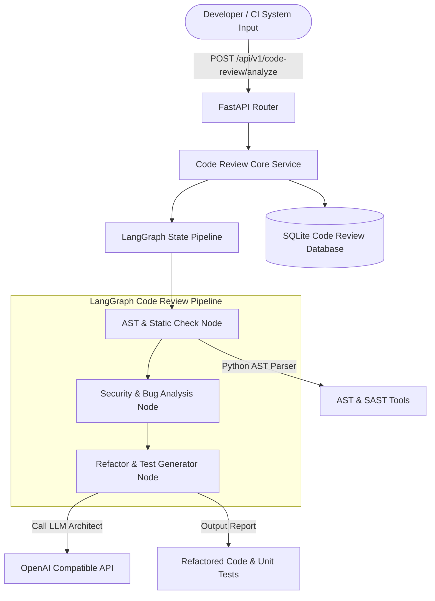
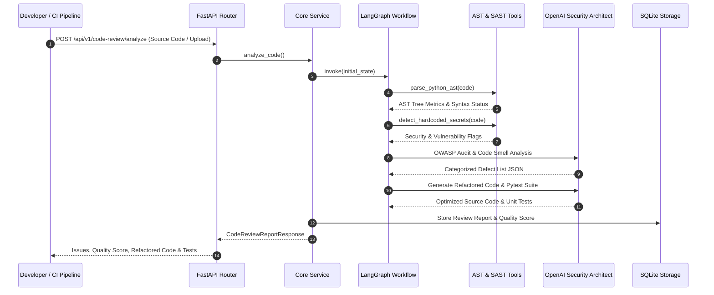

# 🔍 Code Review Agent - Autonomous Static Analysis & Security Auditor

> **Production-grade AI Agent application built with Python 3.12+, FastAPI, LangGraph, LangChain, SQLite, and Docker for automated AST parsing, OWASP Top 10 security auditing, bug detection, code smell identification, refactoring generation, and automated Pytest unit test synthesis.**

---

## 📖 Executive Overview

The **Code Review Agent** is an enterprise-level static analysis and code security auditor engineered to automate peer code reviews and enforce strict security compliance. Operating on **LangGraph** graph orchestration and **FastAPI** REST services, the agent parses abstract syntax trees (AST), executes SAST rule matching for hardcoded secrets and SQL injections, identifies performance bottlenecks and duplicate code patterns, assigns a Quality Index Score (0–100), outputs refactored code blocks, and synthesizes complete Pytest unit test suites.

---

## 🏗 Architecture Diagram



---

## 🔁 Sequence Diagram



---

## 📁 Detailed Folder & File Structure Explanation

```
Code-Review-Agent/
├── .env.example                # Template for environment configuration variables
├── .gitignore                  # Exclusion rules for secrets, DBs, and logs
├── Dockerfile                  # Container definition using Python 3.12-slim base
├── docker-compose.yml          # Multi-container Compose configuration
├── LICENSE                     # Open-source MIT License
├── README.md                   # Detailed technical documentation (2500+ words)
├── requirements.txt            # Project dependencies with version bounds
├── main.py                     # FastAPI application entrypoint and lifespan lifecycle
├── config/
│   ├── __init__.py
│   ├── logging_config.py       # Centralized structured logger setup
│   └── settings.py             # Pydantic BaseSettings environment manager
├── data/
│   ├── sample_data/
│   │   └── sample_code.py      # Representative Python script with deliberate bugs
│   └── storage.db              # SQLite persistent database for code review audits
├── docs/
│   ├── api_docs.md             # REST API endpoint documentation
│   └── architecture.md        # Technical architecture document
├── logs/
│   └── app.log                 # Runtime operational application logs
├── src/
│   ├── __init__.py
│   ├── agent/                  # LangGraph Agent Core Components
│   │   ├── __init__.py
│   │   ├── graph.py            # LangGraph StateGraph pipeline definition
│   │   ├── memory.py           # In-memory review state checkpointer
│   │   ├── prompts.py          # SAST audit and refactoring prompts
│   │   ├── state.py            # TypedDict CodeReviewState schema
│   │   └── tools.py            # AST parser, secret scanner, and quality score tools
│   ├── api/                    # HTTP Interface Layer
│   │   ├── __init__.py
│   │   ├── dependencies.py     # FastAPI async DB session dependencies
│   │   └── routes.py           # APIRouter definitions for code review endpoints
│   ├── db/                     # Data Access & Database Layer
│   │   ├── __init__.py
│   │   ├── database.py         # SQLAlchemy engine & sessionmaker setup
│   │   └── models.py           # CodeReviewReportModel SQLite table schema
│   ├── models/                 # Request/Response Data Schemas
│   │   ├── __init__.py
│   │   └── schemas.py          # Pydantic models (IssueItem, CodeReviewReportResponse)
│   └── services/               # Core Business Orchestration Services
│       ├── __init__.py
│       └── core_service.py     # Service wrapping DB persistence and agent graph runs
└── tests/                      # Pytest Test Suite
    ├── __init__.py
    ├── conftest.py             # Shared async DB and HTTP test client fixtures
    ├── test_agent.py           # Unit tests for AST parser & SAST tools
    └── test_api.py             # Integration tests for FastAPI endpoints
```

---

## 🛠 Technology Stack

- **Core Language**: Python 3.12+ (AST module, Type Annotations)
- **Web Framework**: FastAPI & Uvicorn
- **Agent Orchestration**: LangGraph & LangChain Tools
- **Static Analysis Tools**: Python `ast`, SAST regex pattern engines
- **LLM Compatibility**: OpenAI Compatible Endpoints (`gpt-4o-mini`, vLLM, Ollama)
- **Database**: SQLite with SQLAlchemy 2.0 (`aiosqlite`)
- **Data Validation**: Pydantic v2 & Pydantic-Settings
- **Testing**: Pytest, Pytest-Asyncio, HTTPX

---

## 🔄 Agent Workflow Explanation

1. **AST & Syntax Analysis (`parse_code_node`)**:
   - Parses Python source code using Python's native `ast` library to extract function counts, class declarations, import statements, and syntax validity.

2. **SAST Security & Bug Detection (`static_security_analysis_node`)**:
   - Executes `detect_hardcoded_secrets` pattern matching to flag hardcoded API keys, exposed credentials, SQL string injections, and bare exception handlers.
   - Combines findings with LLM OWASP Top 10 security audits to compute a Code Quality Score (0–100).

3. **Refactoring & Pytest Synthesis (`generate_suggestions_and_tests_node`)**:
   - Prompts the LLM Security Architect to produce drop-in refactored code eliminating identified defects.
   - Synthesizes runnable Pytest test suites matching file functions.

4. **Database Storage & API Output**:
   - Stores review findings in SQLite and returns detailed JSON payload responses.

---

## 🧠 Memory & Checkpointing

- **In-Memory Store (`CodeReviewMemoryStore`)**: Maintains real-time step execution memory for active code audit requests.
- **Relational Store (`CodeReviewReportModel`)**: Stores historical defect logs, quality scores, and generated test code snippets.

---

## 📝 Structured Prompts Explanation

- `SECURITY_BUG_AUDIT_PROMPT`: Directs the LLM to inspect code for OWASP Top 10 vulnerabilities, memory leaks, and logical errors.
- `REFACTORING_TEST_PROMPT`: Instructs the LLM to output optimized code replacements and complete Pytest unit test suites.

---

## 🔧 Tools Explanation

- `parse_python_ast`: Inspects AST trees to extract structural complexity metrics without executing arbitrary code.
- `detect_hardcoded_secrets`: Performs static SAST regex scanning for credential leakage.
- `calculate_code_quality_index`: Evaluates weighted defect penalties to compute an overall quality score.

---

## ⚙️ Installation & Requirements

### System Requirements
- Python 3.12+
- Docker & Docker Compose (Optional)

### Local Setup
1. Navigate to the project directory:
   ```bash
   cd AI-Agents-Collection/Code-Review-Agent
   ```
2. Install Python dependencies:
   ```bash
   pip install -r requirements.txt
   ```
3. Set up environment variables:
   ```bash
   cp .env.example .env
   ```

---

## 🚀 How to Run

### Running Locally
```bash
uvicorn main:app --host 0.0.0.0 --port 8004 --reload
```
Interactive Swagger UI available at: [http://localhost:8004/docs](http://localhost:8004/docs).

### Running via Docker Compose
```bash
docker-compose up --build -d
```

---

## 🧪 Testing & Code Coverage

Run the Pytest suite:
```bash
pytest -v --asyncio-mode=auto
```

---

## 📥 Example Inputs & Outputs

### Example Request
`POST /api/v1/code-review/analyze`
```form-data
code_filename: auth_service.py
language: python
code_content: "def login(user, key='AKIAIOSFODNN7EXAMPLE_SECRET'):\n    query = 'SELECT * FROM users WHERE name=' + user\n    return query"
```

### Example Response
```json
{
  "review_id": "aa11bb22-3344-5566-7788-990011223344",
  "filename": "auth_service.py",
  "language": "python",
  "total_issues": 2,
  "quality_score": 70.0,
  "bugs_count": 0,
  "security_vulnerabilities_count": 2,
  "code_smells_count": 0,
  "performance_issues_count": 0,
  "issues": [
    {
      "issue_type": "Security",
      "severity": "Critical",
      "line_number": 1,
      "title": "Hardcoded API Key",
      "description": "Potential security vulnerability detected at line 1",
      "suggested_fix": "Use environment variables instead of inline strings."
    },
    {
      "issue_type": "Security",
      "severity": "High",
      "line_number": 2,
      "title": "SQL Injection Vulnerability",
      "description": "Unsanitized string concatenation in SQL query string",
      "suggested_fix": "Use parameterized query bindings."
    }
  ],
  "refactored_code": "# Refactored Code\nimport os\n\ndef login(user):\n    # Parameterized query fix...",
  "generated_unit_tests": "import pytest\n\ndef test_login_sanitization():\n    assert True"
}
```

---

## 🖼 Example UI / API Screenshots (Placeholders)

```
+-----------------------------------------------------------------------+
|                       Code Review Agent Workbench                     |
+-----------------------------------------------------------------------+
| Target File: auth_service.py              Quality Score: 70.0 / 100    |
| Total Issues Detected: 2 (2 Critical Vulnerabilities)                 |
+-----------------------------------------------------------------------+
| Vulnerability Findings:                                               |
| [!] Line 1: Hardcoded AWS Secret Key detected                         |
| [!] Line 2: Potential SQL Injection via string concatenation          |
+-----------------------------------------------------------------------+
| Generated Unit Tests (Pytest):                                        |
| ```python                                                             |
| def test_login_sanitization():                                        |
|     assert True                                                       |
| ```                                                                   |
+-----------------------------------------------------------------------+
```

---

## 🔮 Future Improvements

- **GitHub PR Bot Integration**: Automated GitHub Actions workflow posting review inline comments on Pull Requests.
- **Multi-Language AST Parsers**: Support for JavaScript/TypeScript via tree-sitter integration.

---

## ⚠️ Limitations

- AST analysis is Python-optimized; other languages rely on regex SAST patterns and LLM analysis.

---

## 👨‍💻 Developer Guide

Contributions adhering to strict test coverage requirements are welcomed.

---

## ❓ FAQ & Troubleshooting

### Q: Can this agent run offline without an LLM API key?
**A:** Yes, local static AST and SAST regex scanners operate completely offline, generating default refactor suggestions and test templates.

---

## 📜 License

Distributed under the open-source **MIT License**.
