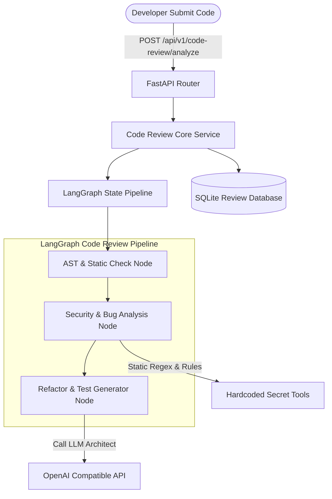

# Code Review Agent - Architecture Documentation

## System Architecture

```mermaid
graph TD
    Client([Developer Submit Code]) -->|POST /api/v1/code-review/analyze| API[FastAPI Router]
    API --> Service[Code Review Core Service]
    Service --> GraphEngine[LangGraph State Pipeline]

    subgraph LangGraph Code Review Pipeline
        ASTNode[AST & Static Check Node] --> SASTNode[Security & Bug Analysis Node]
        SASTNode --> RefactorNode[Refactor & Test Generator Node]
    end

    GraphEngine --> ASTNode
    SASTNode -->|Static Regex & Rules| SASTTools[Hardcoded Secret Tools]
    RefactorNode -->|Call LLM Architect| OpenAI[OpenAI Compatible API]

    Service --> DB[(SQLite Review Database)]
```
