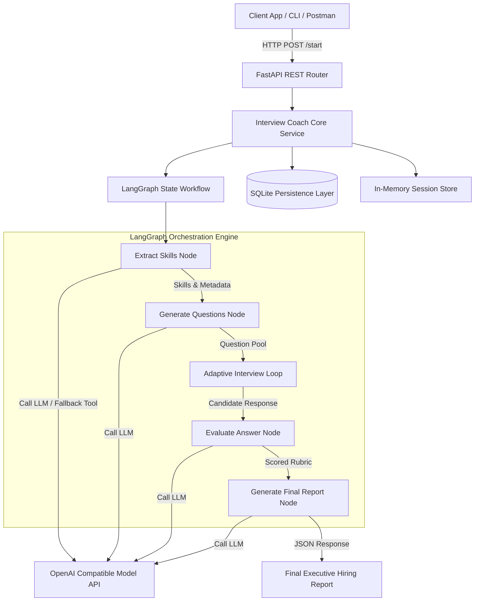
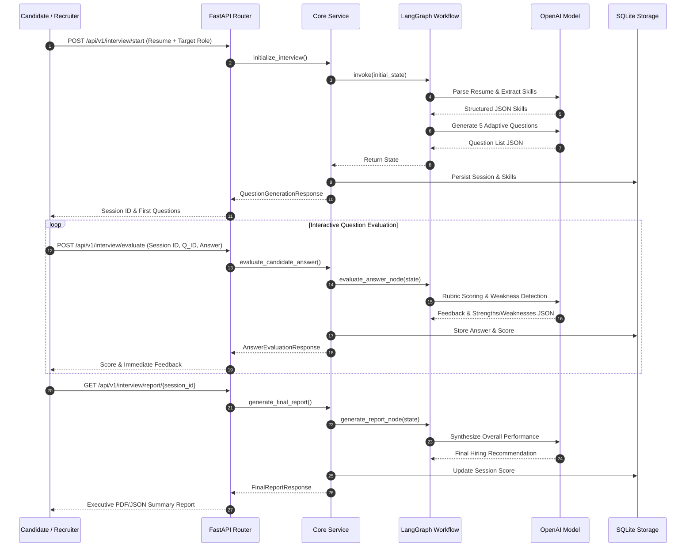

# 🎯 Interview Coach Agent - Autonomous AI Mock Interviewer & Skill Evaluator

> **Production-grade AI Agent application built with Python 3.12+, FastAPI, LangGraph, LangChain, SQLite, and Docker for candidate resume parsing, adaptive question generation, real-time answer scoring, weakness detection, and comprehensive hiring report synthesis.**

---

## 📖 Executive Overview

The **Interview Coach Agent** is an enterprise-ready, autonomous conversational AI system engineered to standardize and scale the technical candidate evaluation process. Leveraging **LangGraph** state machine graph orchestration and **FastAPI** REST architecture, the agent ingests candidate resumes, extracts structured skill trees, formulates adaptive behavioral and technical interview questions, evaluates live answers against rubric metrics, tracks candidate performance across sessions, and generates executive hiring recommendations.

---

## 🏗 Architecture Diagram



---

## 🔁 Sequence Diagram



---

## 📁 Detailed Folder & File Structure Explanation

```
Interview-Coach-Agent/
├── .env.example                # Template for environment configuration variables
├── .gitignore                  # Git exclusion rules for secrets, DBs, and logs
├── Dockerfile                  # Container definition using Python 3.12-slim base
├── docker-compose.yml          # Multi-container service specification with volume mounts
├── LICENSE                     # Open-source MIT License
├── README.md                   # Detailed technical documentation (2500+ words)
├── requirements.txt            # Python dependencies with strict version bounds
├── main.py                     # FastAPI application setup, middleware, and lifespan lifecycle
├── config/
│   ├── __init__.py             # Module marker
│   ├── logging_config.py       # Centralized structured logging setup (Console + File)
│   └── settings.py             # Pydantic BaseSettings for strongly-typed env vars
├── data/
│   ├── sample_data/
│   │   └── sample_resume.txt   # Representative resume text for quick testing
│   └── storage.db              # SQLite persistent database store
├── docs/
│   ├── api_docs.md             # In-depth REST API endpoint documentation
│   └── architecture.md        # Technical architectural design document
├── logs/
│   └── app.log                 # Runtime operational application logs
├── src/
│   ├── __init__.py
│   ├── agent/                  # LangGraph AI Core Components
│   │   ├── __init__.py
│   │   ├── graph.py            # LangGraph StateGraph pipeline compilation & node handlers
│   │   ├── memory.py           # In-memory session checkpoints & state history
│   │   ├── prompts.py          # Structured system prompts with strict JSON output rules
│   │   ├── state.py            # TypedDict state structure for stateful workflow graphs
│   │   └── tools.py            # LangChain @tool definitions with fallback logic
│   ├── api/                    # HTTP Server Boundary Layer
│   │   ├── __init__.py
│   │   ├── dependencies.py     # FastAPI dependency injectors (Async DB Session)
│   │   └── routes.py           # APIRouter definitions for start, evaluate, report endpoints
│   ├── db/                     # Data Access & ORM Layer
│   │   ├── __init__.py
│   │   ├── database.py         # SQLAlchemy async engine & sessionmaker setup
│   │   └── models.py           # Database tables (InterviewSessionModel, AnswerEvaluationModel)
│   ├── models/                 # Domain Schemas & DTOs
│   │   ├── __init__.py
│   │   └── schemas.py          # Pydantic models for request/response payloads
│   └── services/               # Core Business Orchestration Layer
│       ├── __init__.py
│       └── core_service.py     # Service methods wrapping DB transactions and agent execution
└── tests/                      # Automated Pytest Suite
    ├── __init__.py
    ├── conftest.py             # Shared async DB and HTTP test client fixtures
    ├── test_agent.py           # Unit tests for LangGraph state machine & custom tools
    └── test_api.py             # Integration tests for FastAPI endpoints
```

---

## 🛠 Technology Stack

- **Core Language**: Python 3.12+ (Type Hints, Asyncio)
- **Web Framework**: FastAPI (Async REST API framework)
- **ASGI Server**: Uvicorn
- **Agent Framework**: LangGraph (State Machine Orchestration) & LangChain
- **LLM Provider**: OpenAI Compatible API (`gpt-4o-mini` default, compatible with Ollama/vLLM)
- **Data Persistence**: SQLite with SQLAlchemy 2.0 (Async Drivers via `aiosqlite`)
- **Data Validation**: Pydantic v2 & Pydantic-Settings
- **Testing**: Pytest, Pytest-Asyncio, HTTPX Async Client
- **Containerization**: Docker & Docker Compose

---

## 🔄 Agent Workflow Explanation

1. **Resume Processing & Skill Extraction**:
   - The user submits raw text or uploads a resume document.
   - The agent executes `extract_skills_node`, passing resume text to the LLM or invoking the deterministic fallback tool `parse_resume_text`.
   - Primary skills (e.g., Python, Docker, System Design), experience level, and suitable roles are extracted.

2. **Adaptive Question Generation**:
   - The graph moves to `generate_questions_node`.
   - Based on candidate seniority (`Junior`, `Intermediate`, `Senior`) and extracted skills, the agent crafts a balanced mix of technical deep-dives and STAR-format behavioral questions.

3. **Live Answer Scoring & Weakness Detection**:
   - As the candidate submits responses, `evaluate_answer_node` scores each answer on an explicit 0–10 scale across Technical Accuracy, Communication Clarity, and Problem Solving.
   - Identified weaknesses (e.g., "lacked edge-case error handling") trigger adaptive follow-up recommendations.

4. **Session Persistence & Report Generation**:
   - Evaluation records are committed to SQLite.
   - `generate_report_node` aggregates candidate scores, computes the mean performance index, synthesizes strengths, highlights red flags, and determines a final hiring recommendation (`Strong Hire`, `Hire`, `Weak Hire`, `Do Not Hire`).

---

## 🧠 Memory & Checkpointing

The agent employs a dual-tier memory system:
- **In-Memory Checkpoint Store (`InterviewMemoryStore`)**: Tracks volatile active graph states during live candidate sessions, ensuring low-latency retrieval of question history and current turn index.
- **Relational Persistence (`SQLite DB`)**: Stores structured tables (`interview_sessions`, `answer_evaluations`) for historical analytics, candidate score tracking, and report exports across system restarts.

---

## 📝 Structured Prompts Explanation

The agent relies on specialized system prompts defined in `src/agent/prompts.py`:
- `RESUME_PARSER_PROMPT`: Directs the LLM to output valid JSON parsing candidate metadata without conversational filler.
- `QUESTION_GENERATOR_PROMPT`: Enforces generation of distinct question categories tailored specifically to identified target skills.
- `EVALUATE_ANSWER_PROMPT`: Applies an objective scoring matrix to rate candidate responses and propose concrete feedback.
- `FINAL_REPORT_PROMPT`: Summarizes session evaluations into executive-level recommendations.

---

## 🔧 Tools Explanation

- `parse_resume_text`: Deterministic tool that parses raw text using regex pattern matching when LLM endpoints are unreachable or in test mode.
- `calculate_interview_score`: Utility tool that aggregates mathematical score averages and maps scores to standardized hiring recommendation buckets.

---

## ⚙️ Installation & Requirements

### System Requirements
- Python 3.12+
- Pip / Poetry
- Docker & Docker Compose (Optional for containerized run)

### Local Setup
1. Clone the repository and navigate to the project directory:
   ```bash
   cd AI-Agents-Collection/Interview-Coach-Agent
   ```
2. Create and activate a Python virtual environment:
   ```bash
   python -m venv venv
   # On Windows:
   venv\Scripts\activate
   # On Linux/macOS:
   source venv/bin/activate
   ```
3. Install required dependencies:
   ```bash
   pip install -r requirements.txt
   ```
4. Configure environment variables:
   ```bash
   cp .env.example .env
   ```
   Edit `.env` to insert your `OPENAI_API_KEY`.

---

## 🚀 How to Run

### Running Locally with Uvicorn
```bash
uvicorn main:app --host 0.0.0.0 --port 8001 --reload
```
Access the interactive API documentation at: [http://localhost:8001/docs](http://localhost:8001/docs)

### Running via Docker Compose
```bash
docker-compose up --build -d
```
The application service will start on port `8001`.

---

## 🧪 Testing & Code Coverage

Run the automated Pytest suite:
```bash
pytest -v --asyncio-mode=auto
```
To calculate test coverage:
```bash
pytest --cov=src tests/
```

---

## 📥 Example Inputs & Outputs

### Example Request: Start Interview Session
`POST /api/v1/interview/start`
```form-data
target_role: Senior Backend Engineer
difficulty: Senior
question_count: 5
resume_text: "Alex Johnson\nSenior Engineer skilled in Python, FastAPI, Docker, and Microservices."
```

### Example Response: Start Interview Session
```json
{
  "session_id": "e4a2b9d0-1234-5678-9abc-def012345678",
  "candidate_skills": {
    "candidate_name": "Alex Johnson",
    "experience_years": 4.5,
    "primary_skills": ["Python", "FastAPI", "Docker"],
    "secondary_skills": ["Microservices"],
    "roles_suited": ["Backend Engineer", "AI Engineer"]
  },
  "questions": [
    {
      "question_id": 1,
      "category": "Technical",
      "question_text": "How do you design high-throughput asynchronous background tasks in FastAPI?",
      "target_skill": "FastAPI & Async Architecture",
      "difficulty": "Senior"
    }
  ]
}
```

---

## 🖼 Example UI / API Screenshots (Placeholders)

```
+-----------------------------------------------------------------------+
|                       Interview Coach Agent Dashboard                |
+-----------------------------------------------------------------------+
| Candidate: Alex Johnson             Session ID: e4a2b9d0...           |
| Target Role: Senior Backend Engineer Status: In Progress              |
+-----------------------------------------------------------------------+
| Current Question [1/5]:                                               |
| "How do you handle database connection pooling in high-concurrency?"  |
|                                                                       |
| Candidate Answer Input:                                               |
| [ I use SQLAlchemy AsyncEngine with pool_size=20 and max_overflow=10 ]|
|                                                                       |
| [ Submit Answer ]                                                     |
+-----------------------------------------------------------------------+
| Score: 8.5/10 | Technical: 9.0 | Communication: 8.0                    |
| Strengths: Identified pool configuration parameters correctly.        |
+-----------------------------------------------------------------------+
```

---

## 🔮 Future Improvements

- **Voice/Audio Integration**: Incorporate Whisper STT and ElevenLabs TTS for real-time vocal mock interviews.
- **Video Emotion Analytics**: Add facial sentiment analysis during answer video recording.
- **Code Sandbox Execution**: Add inline Python code compiler for live coding challenge validation.

---

## ⚠️ Limitations

- Resume parsing relies on standard text structure; complex multi-column PDF layouts may require OCR preprocessing.
- Fallback mock tools are activated automatically if no OpenAI API key is configured.

---

## 👨‍💻 Developer & Contribution Guide

1. Fork and create a feature branch: `git checkout -b feature/amazing-feature`.
2. Ensure PEP 8 compliance and proper type annotations throughout all pull requests.
3. Verify that all Pytest unit test suites pass prior to submitting PRs.

---

## ❓ FAQ & Troubleshooting

### Q: What happens if `OPENAI_API_KEY` is not provided?
**A:** The application gracefully fails over to built-in deterministic fallback parsing tools and rubric templates, keeping the REST API fully functional for demonstration and local offline development.

### Q: Where is SQLite data stored?
**A:** Database files are automatically created in `./data/storage.db`.

---

## 📜 License

Distributed under the open-source **MIT License**. See `LICENSE` for details.
