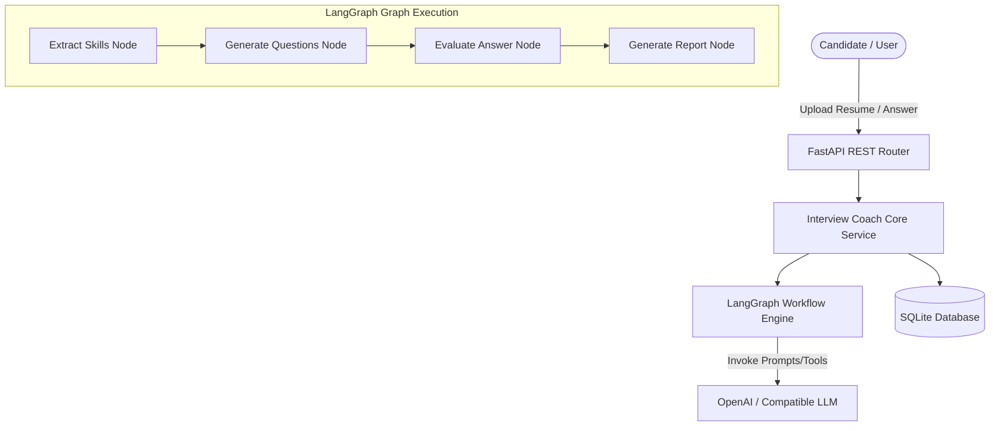

# Interview Coach Agent - Architecture Documentation

## System Overview
The Interview Coach Agent is an end-to-end AI-powered mock interviewer designed using FastAPI, LangGraph, and SQLite.

## State Machine
The agent manages interview progress using a stateful LangGraph execution state (`InterviewState`) persisting session data in-memory and to SQLite DB.
