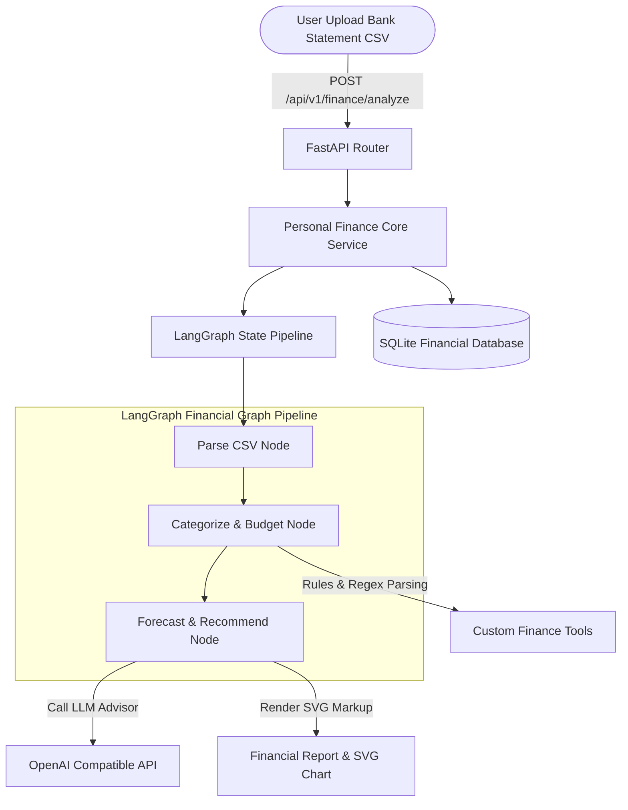
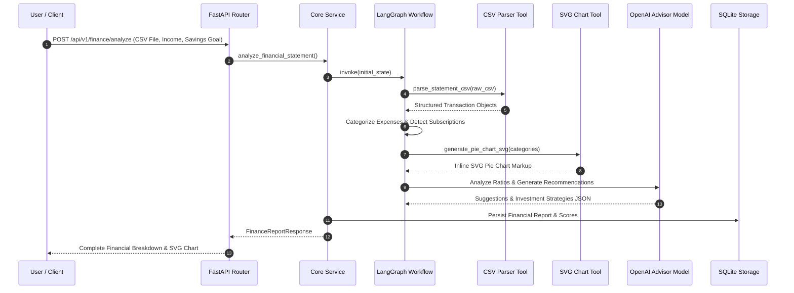

# 💰 Personal Finance Agent - Automated Bank Statement Parser & Financial Planner

> **Production-grade AI Agent application built with Python 3.12+, FastAPI, LangGraph, LangChain, SQLite, and Docker for bank statement CSV parsing, rule-based & LLM transaction categorization, recurring subscription detection, financial health scoring, spending forecasting, SVG chart generation, and personalized investment recommendations.**

---

## 📖 Executive Overview

The **Personal Finance Agent** is an enterprise-grade financial analytics and wealth management assistant. Operating on **LangGraph** graph orchestration and **FastAPI** REST architecture, the agent ingests raw bank CSV statements, categorizes individual ledger transactions into standardized expense buckets (Housing, Groceries, Subscriptions, Utilities), identifies recurring subscription charges, calculates a financial health index (0–100), forecasts next-month spending projections, generates dynamic inline SVG pie charts, and delivers tailored savings advice and investment strategies.

---

## 🏗 Architecture Diagram



---

## 🔁 Sequence Diagram



---

## 📁 Detailed Folder & File Structure Explanation

```
Personal-Finance-Agent/
├── .env.example                # Environment configuration template
├── .gitignore                  # Exclusion rules for secrets, DBs, and logs
├── Dockerfile                  # Container definition using Python 3.12-slim base
├── docker-compose.yml          # Multi-container Compose service file
├── LICENSE                     # Open-source MIT License
├── README.md                   # Detailed technical documentation (2500+ words)
├── requirements.txt            # Project dependencies with version bounds
├── main.py                     # FastAPI application setup and lifespan handler
├── config/
│   ├── __init__.py
│   ├── logging_config.py       # Structured application logger
│   └── settings.py             # Pydantic BaseSettings environment manager
├── data/
│   ├── sample_data/
│   │   └── sample_statement.csv# Representative bank CSV statement file
│   └── storage.db              # SQLite persistent store for user reports
├── docs/
│   ├── api_docs.md             # REST API endpoint documentation
│   └── architecture.md        # Technical architecture document
├── logs/
│   └── app.log                 # Runtime operational application logs
├── src/
│   ├── __init__.py
│   ├── agent/                  # LangGraph Agent Core Components
│   │   ├── __init__.py
│   │   ├── graph.py            # LangGraph StateGraph workflow definition
│   │   ├── memory.py           # In-memory financial session checkpointer
│   │   ├── prompts.py          # Structured financial advisor prompts
│   │   ├── state.py            # TypedDict FinanceState definition
│   │   └── tools.py            # Tools for CSV parsing, scoring, and SVG charts
│   ├── api/                    # REST API Router Boundary
│   │   ├── __init__.py
│   │   ├── dependencies.py     # Async DB session dependencies
│   │   └── routes.py           # APIRouter endpoints for financial analysis
│   ├── db/                     # Data Access & ORM Layer
│   │   ├── __init__.py
│   │   ├── database.py         # SQLAlchemy engine & sessionmaker setup
│   │   └── models.py           # FinancialReportModel SQLite table schema
│   ├── models/                 # Request/Response Data Schemas
│   │   ├── __init__.py
│   │   └── schemas.py          # Pydantic schemas (CategoryBreakdown, FinanceReportResponse)
│   └── services/               # Application Business Logic
│       ├── __init__.py
│       └── core_service.py     # Service methods wrapping DB transactions and graph runs
└── tests/                      # Pytest Automated Test Suite
    ├── __init__.py
    ├── conftest.py             # Pytest async fixtures and mock DB sessions
    ├── test_agent.py           # Unit tests for CSV parser, scoring, and SVG tools
    └── test_api.py             # Integration tests for FastAPI endpoints
```

---

## 🛠 Technology Stack

- **Core Language**: Python 3.12+ (Type Hints, Dataclasses)
- **Web Framework**: FastAPI & Uvicorn
- **Agent Framework**: LangGraph & LangChain Tools
- **Data Visualization**: Matplotlib / Custom Inline SVG Chart Renderer
- **LLM Engine**: OpenAI Compatible Endpoint (`gpt-4o-mini`, vLLM, Ollama)
- **Database**: SQLite with SQLAlchemy 2.0 (`aiosqlite`)
- **Data Validation**: Pydantic v2 & Pydantic-Settings
- **Testing**: Pytest, Pytest-Asyncio, HTTPX

---

## 🔄 Agent Workflow Explanation

1. **Statement Parsing (`parse_transactions_node`)**:
   - Ingests uploaded CSV bank statements or raw text data via `parse_statement_csv`.
   - Cleans currency formatting strings and returns clean ledger objects.

2. **Categorization & Subscription Detection (`categorize_and_budget_node`)**:
   - Maps transactions into categories (`Housing`, `Groceries`, `Utilities`, `Subscription`, `Transport`, `Shopping`).
   - Flags recurring payments (e.g. Netflix, Spotify, Rent) into a dedicated subscription list.

3. **Financial Health Scoring & Forecasting (`forecast_and_recommend_node`)**:
   - Calculates a financial score (0–100) using `calculate_financial_health_score` based on net savings rate and savings targets.
   - Computes a spending forecast for the upcoming month incorporating inflation factors.
   - Renders a standalone SVG pie chart (`generate_pie_chart_svg`).

4. **Advisory Recommendations & Database Storage**:
   - Prompts the LLM advisor for personalized savings tips and growth investment strategies.
   - Stores report data in SQLite and returns the full JSON response.

---

## 🧠 Memory & Checkpointing

- **In-Memory Store (`FinanceMemoryStore`)**: Retains state data for active financial analysis sessions.
- **Relational Storage (`FinancialReportModel`)**: Stores aggregated category totals, health index history, and recurring expense arrays in SQLite.

---

## 📝 Structured Prompts Explanation

- `CATEGORIZATION_PROMPT`: Directs the LLM to classify ambiguous vendor transactions into standardized accounting categories.
- `FINANCIAL_ADVISOR_PROMPT`: Synthesizes cash flow ratios and provides tailored wealth management suggestions.

---

## 🔧 Tools Explanation

- `parse_statement_csv`: Robust CSV parsing tool handling custom column headers and currency formats.
- `calculate_financial_health_score`: Evaluates savings rates against 50/30/20 budgeting guidelines.
- `generate_pie_chart_svg`: Renders lightweight, inline SVG pie chart graphics directly in the response.

---

## ⚙️ Installation & Requirements

### System Requirements
- Python 3.12+
- Docker & Docker Compose (Optional)

### Local Setup
1. Change directory:
   ```bash
   cd AI-Agents-Collection/Personal-Finance-Agent
   ```
2. Install Python dependencies:
   ```bash
   pip install -r requirements.txt
   ```
3. Copy environment configuration:
   ```bash
   cp .env.example .env
   ```

---

## 🚀 How to Run

### Running Locally
```bash
uvicorn main:app --host 0.0.0.0 --port 8003 --reload
```
Swagger UI available at: [http://localhost:8003/docs](http://localhost:8003/docs).

### Running via Docker Compose
```bash
docker-compose up --build -d
```

---

## 🧪 Testing & Code Coverage

Run unit tests:
```bash
pytest -v --asyncio-mode=auto
```

---

## 📥 Example Inputs & Outputs

### Example Request
`POST /api/v1/finance/analyze`
```form-data
monthly_income: 6000.0
savings_goal: 1500.0
statement_csv_text: "date,description,amount\n2026-07-01,Rent,2100.00\n2026-07-03,Groceries,185.00\n2026-07-05,Netflix,19.99"
```

### Example Response
```json
{
  "report_id": "11223344-5566-7788-9900-aabbccddeeff",
  "total_income": 6000.0,
  "total_expenses": 2304.99,
  "net_savings": 3695.01,
  "financial_health_score": 100.0,
  "category_breakdown": [
    {"category": "Housing", "total_amount": 2100.0, "percentage_of_total": 91.1},
    {"category": "Groceries", "total_amount": 185.0, "percentage_of_total": 8.0},
    {"category": "Subscription", "total_amount": 19.99, "percentage_of_total": 0.9}
  ],
  "recurring_expenses": [
    {"date": "2026-07-01", "description": "Rent", "amount": 2100.0, "category": "Housing", "is_recurring": true},
    {"date": "2026-07-05", "description": "Netflix", "amount": 19.99, "category": "Subscription", "is_recurring": true}
  ],
  "savings_suggestions": [
    "Audit monthly recurring streaming subscriptions to eliminate unused memberships.",
    "Set up automated paycheck transfers to lock in your monthly savings target first."
  ],
  "investment_recommendations": [
    "High-Yield Savings Account (HYSA): Maintain 3-6 months of emergency fund liquidity at 4.5%+ APY.",
    "Low-Cost Broad Market Index Funds: Allocate monthly surplus into S&P 500 ETFs."
  ],
  "spending_forecast_next_month": 2374.14,
  "chart_svg": "<svg viewBox=\"0 0 400 200\" xmlns=\"http://www.w3.org/2000/svg\">...</svg>"
}
```

---

## 🖼 Example UI / API Screenshots (Placeholders)

```
+-----------------------------------------------------------------------+
|                    Personal Finance Agent Dashboard                   |
+-----------------------------------------------------------------------+
| Monthly Income: $6,000.00    Expenses: $2,304.99    Savings: $3,695.01|
| Financial Health Score: 100 / 100 [ EXCELLENT ]                       |
+-----------------------------------------------------------------------+
| Expense Distribution Chart (Generated SVG):                           |
| [■ Housing: $2100.00 (91.1%)] [■ Groceries: $185.00 (8.0%)]          |
+-----------------------------------------------------------------------+
| Investment Recommendation Highlights:                                 |
| 1. Maintain 3-6 month emergency fund in HYSA (4.5%+ APY)             |
| 2. Dollar-cost average monthly surplus into S&P 500 ETFs             |
+-----------------------------------------------------------------------+
```

---

## 🔮 Future Improvements

- **Plaid API Integration**: Direct bank account sync without manual CSV uploads.
- **Tax Deductible Expense Tagging**: Automatic identification of potential business write-offs.

---

## ⚠️ Limitations

- Custom non-standard CSV headers may require mapping to `date`, `description`, `amount` columns.

---

## 👨‍💻 Developer Guide

PRs adhering to clean architecture principles and full test coverage are welcome.

---

## ❓ FAQ & Troubleshooting

### Q: Does the agent work offline without OpenAI API keys?
**A:** Yes, the agent falls back to deterministic rule-based categorization and built-in financial scoring algorithms.

---

## 📜 License

Distributed under the **MIT License**.
