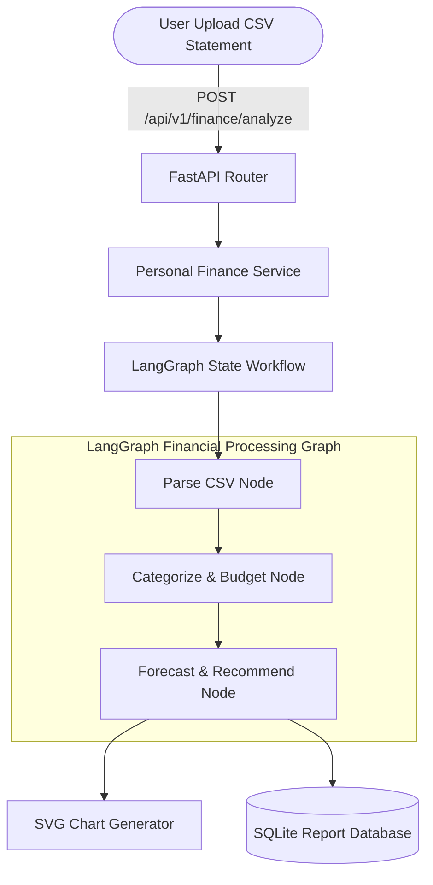

# Personal Finance Agent - Architecture Documentation

## System Overview

```mermaid
graph TD
    Client([User Upload CSV Statement]) -->|POST /api/v1/finance/analyze| API[FastAPI Router]
    API --> CoreService[Personal Finance Service]
    CoreService --> GraphEngine[LangGraph State Workflow]

    subgraph LangGraph Financial Processing Graph
        Node1[Parse CSV Node] --> Node2[Categorize & Budget Node]
        Node2 --> Node3[Forecast & Recommend Node]
    end

    GraphEngine --> Node1
    Node3 --> ChartEngine[SVG Chart Generator]
    Node3 --> DB[(SQLite Report Database)]
```
