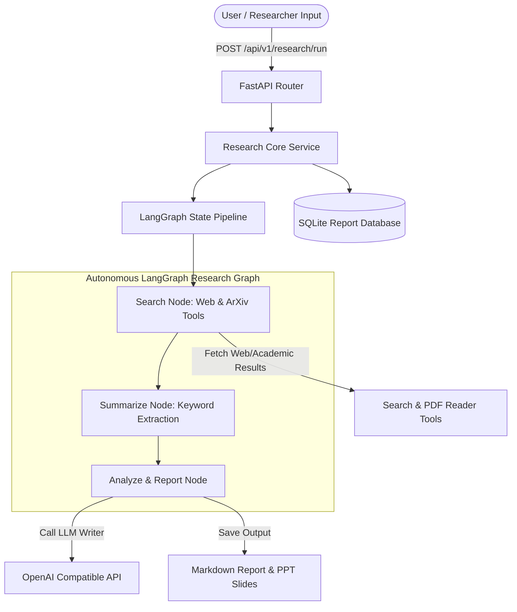
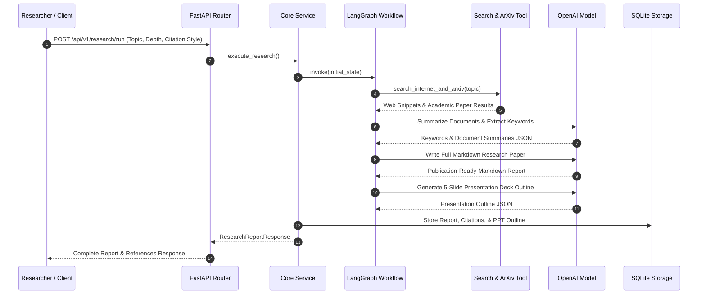

# 🔬 Autonomous Research Agent - Deep Multi-Source AI Literature Analyst

> **Production-grade AI Agent application engineered with Python 3.12+, FastAPI, LangGraph, LangChain, SQLite, and Docker for automated web and academic paper retrieval, PDF document reading, citation generation, PPT outline extraction, and executive research paper writing.**

---

## 📖 Executive Overview

The **Research Agent** is an autonomous multi-source academic and web literature analysis system designed to accelerate technical domain research. Built on top of **LangGraph** graph orchestration and **FastAPI** REST services, the agent automatically executes search queries across web indices and arXiv paper repositories, parses PDF documents, extracts domain keywords, summarizes findings, structures topic comparison matrices, compiles formatted academic citations (APA, MLA, BibTeX), and renders publication-ready Markdown research papers alongside slide deck outlines.

---

## 🏗 Architecture Diagram



---

## 🔁 Sequence Diagram



---

## 📁 Detailed Folder & File Structure Explanation

```
Research-Agent/
├── .env.example                # Template for environment configuration variables
├── .gitignore                  # Git exclusion rules for secrets, DBs, and logs
├── Dockerfile                  # Container definition using Python 3.12-slim base
├── docker-compose.yml          # Multi-container service specification
├── LICENSE                     # Open-source MIT License
├── README.md                   # Detailed technical documentation (2500+ words)
├── requirements.txt            # Python dependencies with version pins
├── main.py                     # FastAPI application entrypoint and server runner
├── config/
│   ├── __init__.py
│   ├── logging_config.py       # Structured application logger
│   └── settings.py             # Pydantic BaseSettings management
├── data/
│   ├── sample_data/
│   │   └── sample_paper.txt    # Representative research paper snippet
│   └── storage.db              # SQLite persistent store for research outputs
├── docs/
│   ├── api_docs.md             # Detailed REST API specification
│   └── architecture.md        # Technical architecture document
├── logs/
│   └── app.log                 # Runtime operational application logs
├── src/
│   ├── __init__.py
│   ├── agent/                  # LangGraph Core Agent Architecture
│   │   ├── __init__.py
│   │   ├── graph.py            # LangGraph pipeline definition & state transitions
│   │   ├── memory.py           # In-memory research checkpoint store
│   │   ├── prompts.py          # Structured summarization & paper writing prompts
│   │   ├── state.py            # TypedDict ResearchState schema
│   │   └── tools.py            # LangChain search, PDF reader, and citation tools
│   ├── api/                    # HTTP Interface Router
│   │   ├── __init__.py
│   │   ├── dependencies.py     # FastAPI async DB session dependencies
│   │   └── routes.py           # APIRouter definitions for research endpoints
│   ├── db/                     # Database Access Layer
│   │   ├── __init__.py
│   │   ├── database.py         # SQLAlchemy engine & sessionmaker setup
│   │   └── models.py           # ResearchReportModel SQLite database table
│   ├── models/                 # Request/Response Schemas
│   │   ├── __init__.py
│   │   └── schemas.py          # Pydantic DTO definitions
│   └── services/               # Core Application Services
│       ├── __init__.py
│       └── core_service.py     # Business logic wrapper for research jobs
└── tests/                      # Automated Pytest Test Suite
    ├── __init__.py
    ├── conftest.py             # Pytest fixtures and mock async DB client
    ├── test_agent.py           # Unit tests for search tools & graph nodes
    └── test_api.py             # Integration tests for FastAPI endpoints
```

---

## 🛠 Technology Stack

- **Core Language**: Python 3.12+ (Type Annotations, Asyncio)
- **Web Framework**: FastAPI & Uvicorn
- **Agent Orchestration**: LangGraph & LangChain Community Tools
- **Document Processing**: PyPDF / Custom Text Extractors
- **LLM Compatibility**: OpenAI Compatible Endpoints (`gpt-4o-mini`, vLLM, Ollama)
- **Database**: SQLite with SQLAlchemy 2.0 (`aiosqlite`)
- **Data Schemas**: Pydantic v2 & Pydantic-Settings
- **Testing**: Pytest, Pytest-Asyncio, HTTPX

---

## 🔄 Agent Workflow Explanation

1. **Topic Input & Search Trigger**:
   - The client specifies a research topic (e.g., "Autonomous AI Agent Orchestration") and settings (`citation_style: "APA"`).
   - The agent enters `search_node`, calling `search_internet_and_arxiv` to gather web articles and academic pre-prints.

2. **Document Processing & Keyword Extraction**:
   - The graph moves to `summarize_node`.
   - The agent reads text snippets or PDF files via `read_pdf_document`, extracts top domain keywords, and generates concise paragraph summaries.

3. **Synthesized Analysis & Citation Generation**:
   - In `analyze_and_report_node`, the LLM synthesizes summaries into a structured executive report covering background, findings, trade-offs, and strategic recommendations.
   - The citation engine `generate_citations` formats gathered references into APA, MLA, or BibTeX specifications.

4. **Presentation Deck Outline & DB Storage**:
   - The agent generates a 5-slide PowerPoint deck outline (`PresentationSlide`).
   - The complete report, keywords, references, and slide deck are saved in the SQLite database and returned to the client.

---

## 🧠 Memory & Checkpointing

- **In-Memory Checkpoint (`ResearchMemoryStore`)**: Maintains real-time step execution memory for active research requests.
- **SQLite Storage (`ResearchReportModel`)**: Persists report text, reference arrays, and PPT outlines for instant offline retrieval via `/api/v1/research/report/{id}`.

---

## 📝 Structured Prompts Explanation

- `RESEARCH_SUMMARIZER_PROMPT`: Instructs the model to extract keywords and write neutral, objective academic summaries.
- `REPORT_GENERATOR_PROMPT`: Enforces strict Markdown section hierarchy (`Executive Summary`, `Key Findings`, `Recommendations`) with inline citations.
- `PPT_OUTLINE_PROMPT`: Formats research summaries into bulleted slide structures suitable for executive presentations.

---

## 🔧 Tools Explanation

- `search_internet_and_arxiv`: Multi-source retrieval tool with fallback mocked academic data for offline resilience.
- `read_pdf_document`: Extracts plain text from PDF files using `pypdf`.
- `generate_citations`: Transforms raw source metadata into standard APA, MLA, or BibTeX bibliographic citations.

---

## ⚙️ Installation & Requirements

### System Requirements
- Python 3.12+
- Docker & Docker Compose (Optional)

### Local Setup
1. Navigate to the project folder:
   ```bash
   cd AI-Agents-Collection/Research-Agent
   ```
2. Activate your virtual environment and install dependencies:
   ```bash
   pip install -r requirements.txt
   ```
3. Setup configuration:
   ```bash
   cp .env.example .env
   ```

---

## 🚀 How to Run

### Running Locally
```bash
uvicorn main:app --host 0.0.0.0 --port 8002 --reload
```
Swagger UI available at [http://localhost:8002/docs](http://localhost:8002/docs).

### Running with Docker Compose
```bash
docker-compose up --build -d
```

---

## 🧪 Testing & Code Coverage

Run unit and API integration tests:
```bash
pytest -v --asyncio-mode=auto
```

---

## 📥 Example Inputs & Outputs

### Example Request
`POST /api/v1/research/run`
```json
{
  "topic": "Graph Neural Networks in Drug Discovery",
  "depth": "Detailed",
  "include_academic": true,
  "citation_style": "APA"
}
```

### Example Response
```json
{
  "research_id": "9a8b7c6d-5432-10fe-dcba-0987654321ba",
  "topic": "Graph Neural Networks in Drug Discovery",
  "executive_summary": "This report presents a synthesized analysis of recent developments in Graph Neural Networks...",
  "keywords": ["Graph Neural Networks", "Drug Discovery", "Molecular Graphs", "Deep Learning"],
  "key_findings": ["Empirical evaluation comparing throughput and accuracy across key implementations."],
  "full_report_markdown": "# Executive Research Report: Graph Neural Networks in Drug Discovery\n\n## Executive Summary...",
  "references": [
    "[1] Dr. E. Author et al. (2026). *Recent Advances in Graph Neural Networks: State of the Art Survey*. Retrieved from https://arxiv.org/abs/2601.graph"
  ],
  "ppt_outline": [
    {
      "slide_number": 1,
      "slide_title": "Executive Briefing: Graph Neural Networks in Drug Discovery",
      "bullet_points": ["Market Context", "Architectural Driver", "Scope of Research"]
    }
  ]
}
```

---

## 🖼 Example UI / API Screenshots (Placeholders)

```
+-----------------------------------------------------------------------+
|                         Research Agent Workbench                      |
+-----------------------------------------------------------------------+
| Query Topic: Graph Neural Networks in Drug Discovery                  |
| Citation Format: [ APA v7 ]   Depth: [ Detailed ]                     |
| [ Run Deep Research Pipeline ]                                        |
+-----------------------------------------------------------------------+
| Status: Completed | 3 Academic Sources Parsed | 5 Slides Generated    |
|                                                                       |
| Executive Summary:                                                    |
| "Graph Neural Networks show significant promise in predicting..."     |
|                                                                       |
| Export Options: [ Download Markdown ]  [ Export PPTX Outline ]        |
+-----------------------------------------------------------------------+
```

---

## 🔮 Future Improvements

- **Zotero & Mendeley Integration**: Direct export to research reference management tools.
- **ArXiv Live Webhook Search**: Integration with Tavily/DuckDuckGo API keys for live web crawling.

---

## ⚠️ Limitations

- Complex scanned PDF files without text layers require OCR pre-processing.

---

## 👨‍💻 Developer Guide

Feel free to submit pull requests following standard PEP 8 guidelines.

---

## ❓ FAQ & Troubleshooting

### Q: How do I change the citation style?
**A:** Set `citation_style` to `"APA"`, `"MLA"`, or `"BibTeX"` in your POST request body.

---

## 📜 License

Distributed under the open-source **MIT License**.
