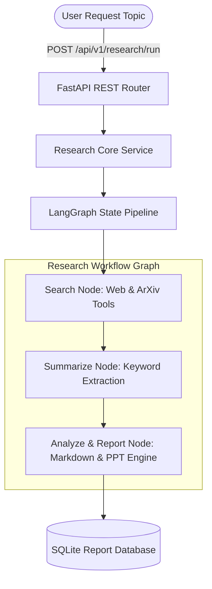

# Research Agent - Architecture Documentation

## System Architecture

```mermaid
graph TD
    Client([User Request Topic]) -->|POST /api/v1/research/run| API[FastAPI REST Router]
    API --> Service[Research Core Service]
    Service --> Engine[LangGraph State Pipeline]

    subgraph Research Workflow Graph
        Node1[Search Node: Web & ArXiv Tools] --> Node2[Summarize Node: Keyword Extraction]
        Node2 --> Node3[Analyze & Report Node: Markdown & PPT Engine]
    end

    Engine --> Node1
    Node3 --> DB[(SQLite Report Database)]
```
